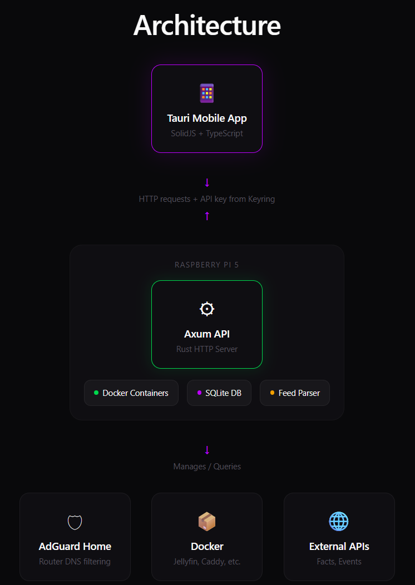

# openhome

Homelab control app with a Rust Axum API and Tauri v2 mobile frontend.

**Tech Stack:** Tauri v2 | Rust | Axum | SolidJS | TypeScript | SQLite



## Features

- **Docker Management** - Control containers on your homelab
- **AdGuard Home** - Router-level DNS filtering
- **Feed Reader** - RSS/Atom feed aggregation
- **Secure** - API key stored in system keyring, not plaintext

## Screenshots

> No screenshots available yet.

## Development

### API (Rust Axum)

```sh
cd api && cargo run          # Dev server
cd api && cargo test         # Run tests
cd api && cargo clippy       # Lint
```

### Mobile (Tauri + SolidJS)

```sh
cd mobile && bun install     # Install dependencies
cd mobile && bun run tauri android dev --host <IP> 
```

## Project Structure

```
openhome/
├── api/           # Rust Axum backend
├── mobile/        # Tauri v2 + SolidJS frontend
```

## Performance

| Metric       | Value   |
|--------------|---------|
| App Size     | ~20 MB  |
| Memory Usage | ~35 MB  |
| Startup Time | <0.5s   |
