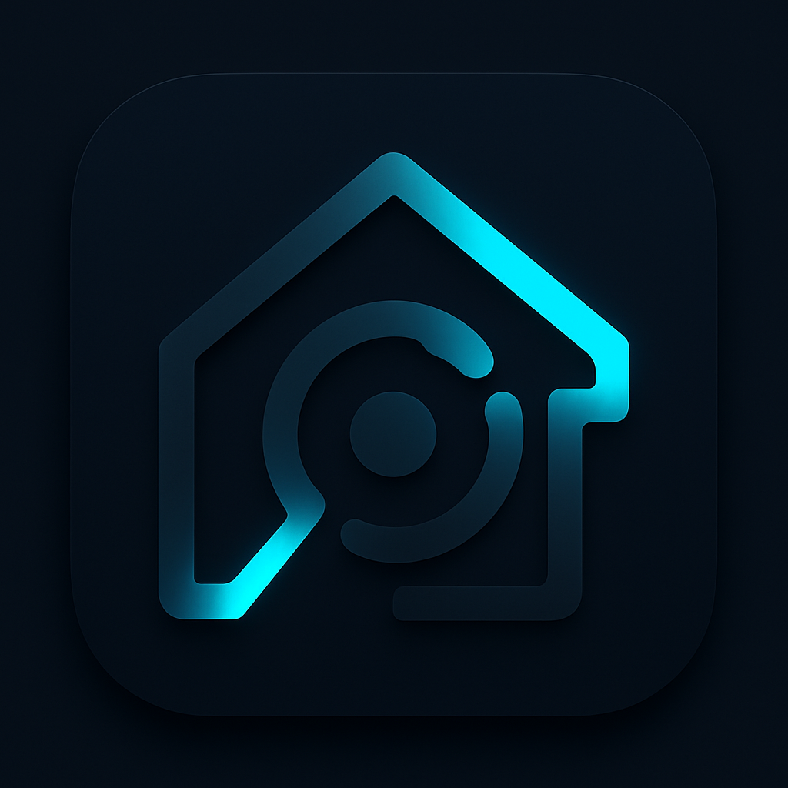
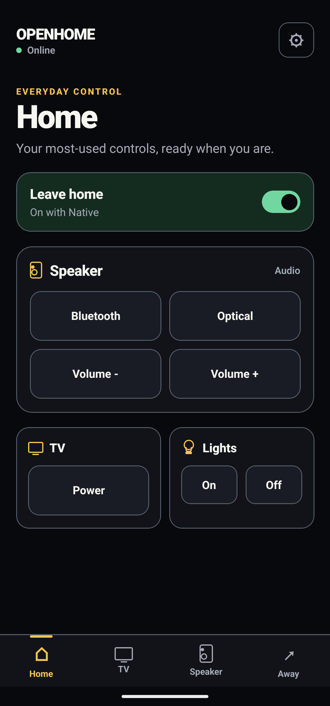
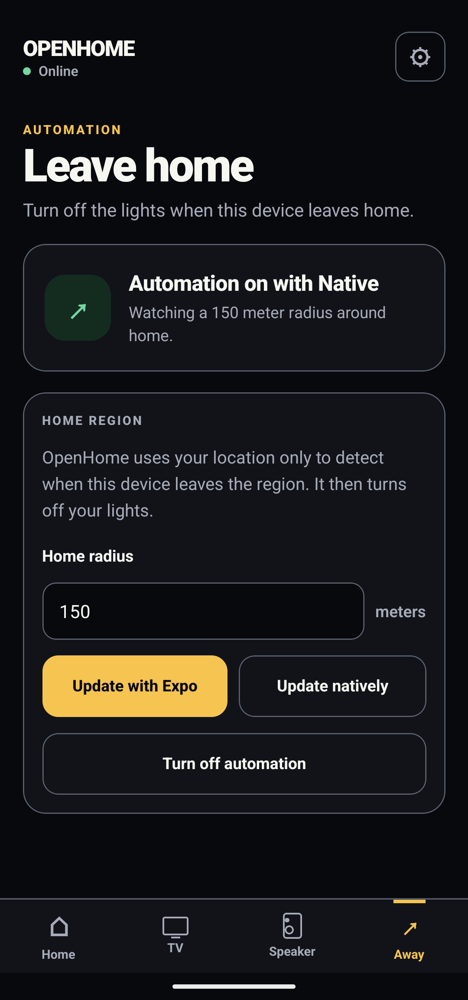
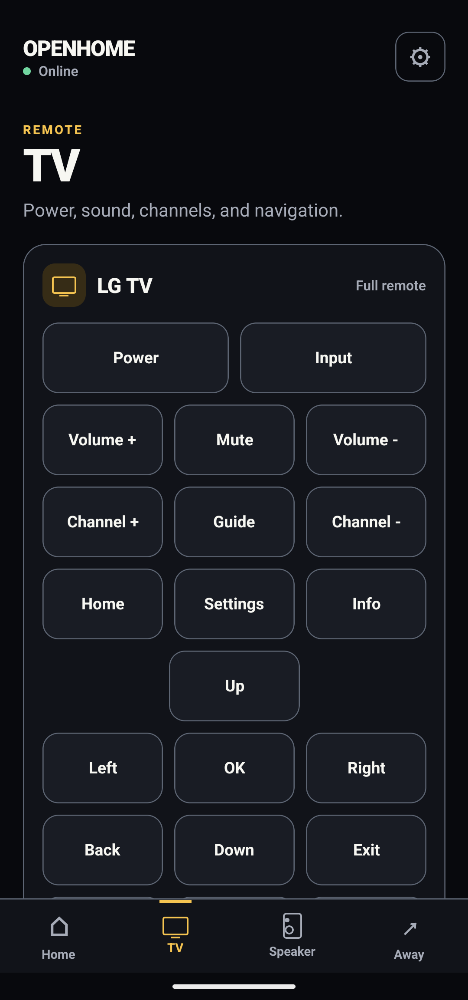
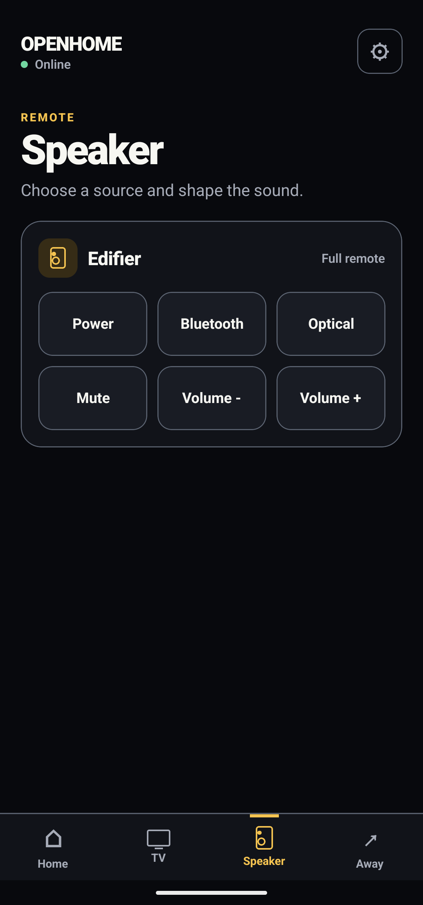
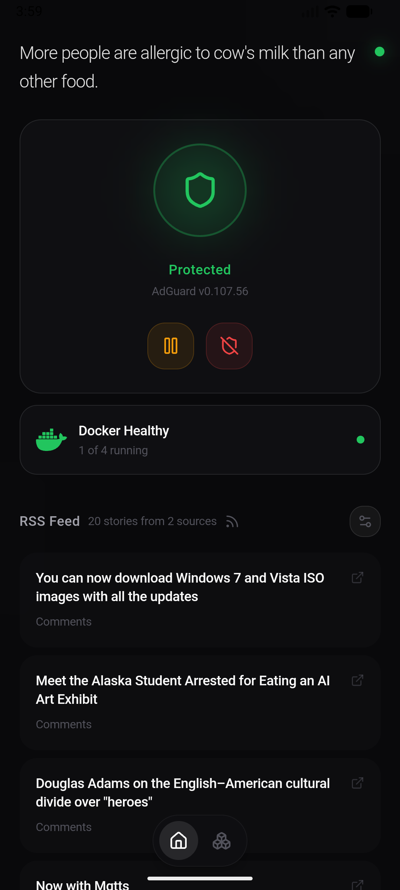
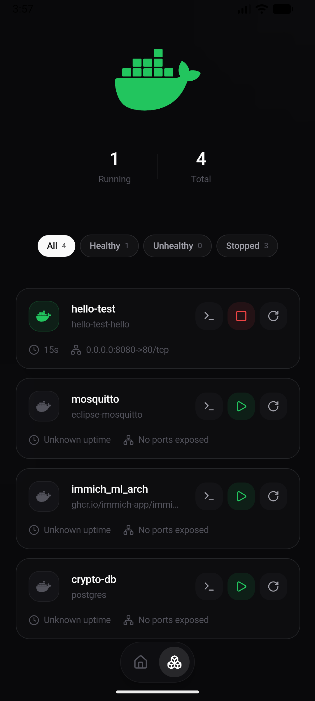
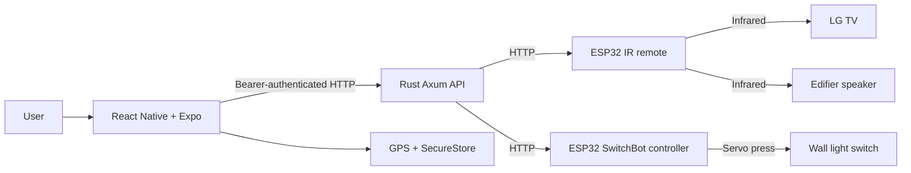

<h1 align="center">openhome</h1>

  

OpenHome is a self-hosted home control system with a cross-platform Android and iOS app. The mobile client is built with React Native and Expo and communicates exclusively with a Rust Axum API.

The API authenticates the client and forwards HTTP requests to two ESP32 devices:

- **ESP32 IR remote:** sends infrared commands to an LG TV and an Edifier speaker.
- **ESP32 SwitchBot controller:** drives a servo that physically turns a light switch on or off.

The app can also register a home geofence and automatically ask the API to turn off the lights when the phone leaves the configured area.

## Screenshots

| Home | Leave home automation |
| :---: | :---: |
|  |  |

| TV remote | Speaker remote |
| :---: | :---: |
|  |  |

### Tauri Client

| Home Dashboard | Docker Management |
| :---: | :---: |
|  |  |

## Features

- Control lights, an LG TV, and an Edifier speaker.
- Load available infrared commands dynamically from the API.
- Swipe between Home, TV, Speaker, and Away tabs.
- Store the Base URL, API key, and geofence configuration in Expo SecureStore.
- Monitor a home geofence without continuous GPS polling.
- Retry a persisted light-off command after a temporary background failure.
- Use either Expo Location or the Android framework location backend.
- View and manage Docker containers on the homelab server.
- Monitor and control AdGuard Home DNS protection.
- Aggregate RSS and Atom feeds into a timeline with read state.
- Retrieve random facts through the API.

## Architecture

The Expo client uses a Clean Architecture-inspired structure:

- `domain` contains parsing, validation, and control definitions.
- `application` owns state transitions and coordinates operations.
- `infrastructure` contains the Axum API, SecureStore, GPS, and geofence adapters.
- `ui` contains React Native screens and components.

```mermaid
flowchart LR
    User[User] --> Mobile[React Native + Expo]
    Mobile -->|Bearer-authenticated HTTP| API[Rust Axum API]
    Mobile --> OS[GPS + SecureStore]
    API -->|HTTP| IR[ESP32 IR remote]
    API -->|HTTP| SwitchBot[ESP32 SwitchBot controller]
    IR -->|Infrared| TV[LG TV]
    IR -->|Infrared| Speaker[Edifier speaker]
    SwitchBot -->|Servo press| Light[Wall light switch]
```

The mobile client never contacts an ESP32 directly. The Axum API is the single integration boundary and uses `IR_BASE_URL` and `SWITCHBOT_BASE_URL` to reach the devices.

## API Image

The Axum API is available as the Docker image [`patrickhaahr/openhome-api:latest`](https://hub.docker.com/r/patrickhaahr/openhome-api).

API access is protected by a Bearer API key. The mobile app stores the key in the platform's secure storage. Use HTTPS outside a trusted local network.
