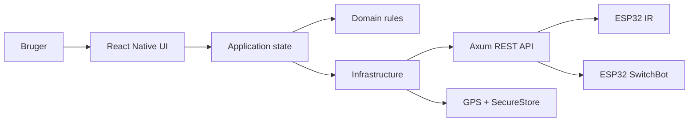

# OpenHome
---
layout: cover
subtitle: En cross-platform fjernbetjening til det smarte hjem
author: React Native · Expo · TypeScript · Axum
---

Lys, TV og højttaler samlet i én app.

Med automatisk slukning, når brugeren forlader hjemmet.

# Fra fire apps til ét hjem
---
layout: two-cols
subtitle: De vigtigste handlinger er altid ét swipe væk
---

{width=30 height=23 fit=contain caption="Hurtig adgang til hjemmets enheder"}

::right::

- styr lys, LG TV og Edifier-højttaler
- hent tilgængelige kommandoer dynamisk
- gem server og API-nøgle sikkert
- swipe mellem enheder

:::tip Live demo
Tænd lyset, skift til TV, og send en IR-kommando.
:::

# Arkitekturen
---
layout: center
subtitle: Mobilklienten taler kun med Axum API'et
---



:::note Clean Architecture
`domain` validerer · `application` koordinerer · `infrastructure` udfører I/O · `ui` renderer
:::

# Når brugeren forlader hjemmet
---
layout: two-cols
subtitle: Operativsystemet vækker appen; application-laget beslutter handlingen
---

```ts [handle-home-geofence-event.ts] {1-4,6-10,12-13} lines title="Baggrundshændelse"
if (event.type !== 'exit' ||
    event.regionState !== 'outside') {
  return success(undefined)
}

const home = await dependencies.loadHome()
if (!home.ok) return home
if (home.value?.identifier !== event.regionIdentifier) {
  return success(undefined)
}

await dependencies.savePending(home.value.identifier)
return retryPendingHomeExit(dependencies)
```

::right::

```ts [open-home-api.ts] {3,6-8} lines title="Sikkert API-kald"
const controller = new AbortController()

const response = await fetch(url, {
  method: 'POST',
  headers: {
    Authorization: `Bearer ${apiKey}`,
  },
  signal: controller.signal,
})
```

:::tip Robusthed
Kommandoen gemmes før netværkskaldet og kan prøves igen efter en midlertidig fejl.
:::

# Resultat og refleksion
---
layout: two-cols
subtitle: En lille app med rigtige platform-, netværks- og sikkerhedskrav
---

{width=29 height=22 fit=contain caption="GPS-baseret automatik"}

::right::

| Verifikation | Resultat |
| --- | --- |
| TypeScript | Verificeret |
| Vitest | 24 tests |
| Expo Doctor | Verificeret |
| Android + iOS bundles | Verificeret |
| Fysisk enhed | Verificeret |

:::warning Vigtigste trade-off
Et lokalt Kotlin-modul øger kompleksiteten, men gør geofencing muligt på Android uden Google Play Services og uden konstant GPS-polling.
:::
